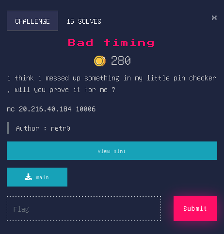

## Bad timing


### Source Code
<em>I used ghidra to decompile the executable file and here is the result.</em>
```c
undefined8 win(void)

{
  system("cat flag.txt");
  return 0;
}
```
```c
undefined8 main(void)

{
  long in_FS_OFFSET;
  int local_20;
  int local_1c;
  time_t local_18;
  long local_10;
  
  local_10 = *(long *)(in_FS_OFFSET + 0x28);
  local_18 = time((time_t *)0x0);
  srand((uint)local_18);
  local_1c = rand();
  local_1c = local_1c % 100;
  __isoc99_scanf(&DAT_00102011,&local_20);
  if (local_1c == local_20) {
    puts("GOOD JOB");
    win();
  }
  else {
    puts("Wrong");
  }
  if (local_10 != *(long *)(in_FS_OFFSET + 0x28)) {
                    /* WARNING: Subroutine does not return */
    __stack_chk_fail();
  }
  return 0;
}
```
### Hint 
> srand(time(NULL)) is it quick enough to not be predictable ?

### Overview
This challenge is based on the concept of Race condition. Where we have to get the modulo of 100 by the same random value from the server.

### Solver
First we need to compile this code ```gcc rand.c -o rand``` in order to run it as child process.
```c
#include <stdio.h>
#include <stdlib.h>
#include <time.h>

int main(int argc, char const *argv[])
{
    srand((unsigned)time(NULL));
    printf("%d\n", rand());
    return 0;
}
```
Then run the solver.
```py
from pwn import *
from time import time
import subprocess

elf = context.binary = ELF('main')
conn = remote('20.216.40.184', 10006)

seed = int(time())
process = subprocess.Popen(['./rand', str(seed)], stdout=subprocess.PIPE)
stdout = process.stdout

leak = stdout.readline().strip()
nb = int(leak) % 100
log.success(f"Leak = {nb}")

conn.sendline(str(nb).encode())
conn.interactive()
conn.close()
```
